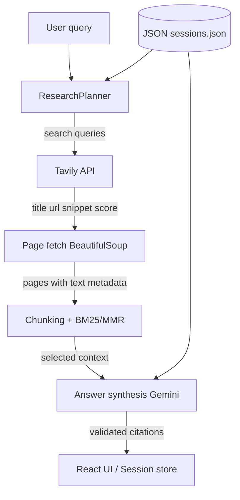

# Deep Research Agent

A custom Python research agent that plans web searches, fetches and selects source content, and synthesizes citation-grounded answers with streaming progress updates. Built for the Sarvam AI Agent Challenge without LangChain, LangGraph, CrewAI, LlamaIndex, or Haystack.

**Stack:** Python (FastAPI), React UI, Tavily (search), Google Gemini (planning & synthesis), BM25+MMR (context selection).

---

## Video Demo

https://www.loom.com/share/db5562aa635d4e0b94cb88367a519f77

## Setup and Run Instructions

### Prerequisites

- Python 3.11+
- Node.js 18+ (for the frontend)
- API keys: [Tavily](https://tavily.com), [Google Gemini](https://ai.google.dev)

### 1. Clone and configure environment

```bash
git clone https://github.com/goku1610/sarvam.git
cd sarvam
cp .env.example .env
```

Edit `.env`:

```env
TAVILY_API_KEY=your_tavily_api_key
GEMINI_API_KEY=your_gemini_api_key
```

### 2. Python backend

```bash
python3 -m venv .venv
source .venv/bin/activate   # Windows: .venv\Scripts\activate
pip install -r requirements.txt
```

### 3. Frontend build

```bash
cd frontend
npm install
npm run build
cd ..
```

### 4. Start the server

```bash
uvicorn main:app --reload --host 0.0.0.0 --port 8000
```

Open **http://127.0.0.1:8000** in your browser.

### 5. Run evaluation (optional)

```bash
python -m eval.run_eval --dry-run          # validate dataset
python -m eval.run_eval --limit 2          # smoke test (2 cases)
python -m eval.run_eval                    # full 12-case deep research eval
```

See [eval/README.md](eval/README.md) for metric definitions and flags (`--with-judge`, `--case`, etc.).

---

## Design Note (Part 1)

### Target users and problem

**Users:** Students, analysts, founders, and knowledge workers who need quick, verifiable briefs on open-web topics—not a full literature review, but more than a single chatbot reply.

**Problem:** General LLMs hallucinate citations and cannot browse live sources. This agent closes that gap by retrieving real pages, selecting evidence, and forcing answers to cite only URLs that were actually fetched.

### Definition of “deep research” (this implementation)

For this project, **deep research** means:

1. **Planned retrieval** — An LLM produces a short strategy and 5–7 diverse search queries (not a single search).
2. **Multi-hop search** — Up to 3 hops: after each hop, the agent evaluates whether evidence is sufficient; if not, it issues follow-up queries (e.g. find a director’s name, then search for their spouse).
3. **Acquire & select** — Full pages are scraped, chunked, and ranked with BM25 + MMR for relevance and domain diversity within a character budget (~32k in deep mode).
4. **Grounded synthesis** — The final report cites sources as `[Title — domain](URL)`; post-processing removes citations that do not match retrieved chunks.
5. **Session continuity** — Follow-up questions reuse prior turns, rolling summaries, and saved evidence; fresh search runs only when the model decides it is needed.

A lighter **fast** mode (single hop, fewer queries) exists in the UI for quicker answers; **evaluation is run only in deep research mode** to match the assignment’s “deep research agent” intent.

### Success metrics (operational)

| Metric | Why it matters |
|--------|----------------|
| **Grounded citation rate** | Every citation URL must exist in selected chunks—measures honesty, not fluency. |
| **Source diversity** | Unique domains cited and retrieved—reduces single-blog bias. |
| **Multi-hop depth** | Hop count and pages opened—for chained questions. |
| **Uncertainty handling** | Explicit hedging when evidence is missing—prevents false confidence. |
| **Conflict transparency** | Disagreement language + multiple citations when sources conflict. |

### Data flow and components



| Module | Role |
|--------|------|
| [`search.py`](search.py) | Tavily search, concurrent page fetch, HTML→text, metadata (`url`, `title`, `domain`, `retrieved_at`) |
| [`filtering.py`](filtering.py) | Overlapping chunks, BM25 relevance, MMR diversity, context cap |
| [`agent_pipeline.py`](agent_pipeline.py) | Shared Plan → Search → Answer loop (API + eval) |
| [`main.py`](main.py) | FastAPI routes, `JsonSessionStore`, citation validation, streaming |
| [`frontend/`](frontend/) | React UI: plan review, streaming progress, citations, follow-up chat |

### Risks and limitations

- **Rate limits** — Tavily and Gemini quotas can throttle long eval runs.
- **Low-quality sources** — Blogs and SEO pages slip through; social/video domains are blocklisted.
- **Conflicting sources** — Prompts ask for explicit disagreement, but detection is not fully automated.
- **Context length** — Large pages are truncated; some relevant content may be dropped.
- **Non-determinism** — Web results change between runs.

### Future improvements

1. **Recency-aware ranking** — Use `retrieved_at` and page dates in chunk scoring, not only BM25 text match.
2. **Dedicated conflict detector** — Lightweight classifier or rules to flag contradictory claims before synthesis.

---

## Agent Flow

For each user query (custom Python loop—no agent framework):

| Step | Behavior | Streamed message |
|------|----------|------------------|
| **Plan** | Generate title, 2-sentence strategy, search queries | “Generating plan and queries” |
| **Search** | Tavily + zero-result retry | “Searching the web” |
| **Acquire** | Fetch HTML, extract text | “Fetching and cleaning sources” |
| **Select context** | BM25 + MMR, cap size | “Selecting relevant context” |
| **Answer** | Grounded report + citation validation | “Generating answer with citations” |

Multi-hop (deep research): **“Evaluating whether context is sufficient”** → optional next-hop queries.

Operational progress only—no hidden chain-of-thought is streamed to the client.

---

## Features (Part 2 checklist)

- **Web search:** Tavily (`title`, `url`, `snippet`, `score`)
- **Page fetch:** aiohttp + BeautifulSoup; unreachable pages recorded with snippets
- **Context:** Relevance (BM25), diversity (MMR + per-domain limits), character budget
- **Citations:** `[Title — domain](URL)` with post-validation against retrieved chunks
- **Sessions:** `session_id` in `data/sessions.json` — messages, turns, rolling summary
- **Turn history:** query, search queries, URLs opened, context snippets, final answer, timestamp
- **Streaming:** FastAPI NDJSON + plan token stream

---

## Example Conversations

### Example 1 — Factual (deep research)

**User:** What is the capital city of Australia?

**Agent (abridged):**

> ## Summary  
> The capital city of Australia is **Canberra**…  
> [Canberra | History, Map, Population, Climate, & Facts — www.britannica.com](https://www.britannica.com/place/Canberra)  
> [Why is Canberra the Capital of Australia — lovecanberra.com.au](https://lovecanberra.com.au/why-is-canberra-the-capital-of-australia)

**Pipeline:** 5 search queries → 5 pages → 14 context chunks → 14 grounded citations (100% format compliance). See full artifact: `eval/results/20260522_130525_a32635/cases/factual_capital_australia.json`.

---

### Example 2 — Multi-hop (deep research)

**User:** Who is the spouse of the director of the film Oppenheimer (2023)?

**Agent:** Plans queries for the director (Christopher Nolan) and spouse; may run 2 hops if the first pass lacks the spouse fact. Citations tie claims to entertainment/news sources.

**Eval result:** PASS — `multi_hop_oppenheimer_spouse` (18.5s).

---

### Example 3 — Multi-turn follow-up

**Turn 1 — User:** What are the main causes of climate change according to recent scientific consensus?

**Turn 1 — Agent:** Synthesizes IPCC/NASA-aligned causes with citations to NASA, IPCC summaries, and review literature.

**Turn 2 — User:** Summarize the key points from your previous answer in three bullet points and cite the same sources where possible.

**Turn 2 — Agent:** Uses session history and saved chunks; typically **no new search** unless evidence is insufficient.

**Eval result:** PASS — `multi_turn_summarize_sources` (28.4s).

---

### Example 4 — Conflicting evidence (needs improvement)

**User:** Is regular coffee consumption good or bad for cardiovascular health?

**Agent:** Retrieves 9 pages across 2 hops and cites multiple studies, but eval flagged **missing explicit conflict language** (e.g. “sources disagree”) despite high grounding (93%).

**Eval result:** FAIL on `conflict_language` — see `eval/results/20260522_130525_a32635/cases/conflicting_coffee_health.json`.

---

## Evaluation Methodology and Findings (Part 3)

Evaluation runs **only in deep research mode** (`deep_research=True`, `max_hops=3`). Details: [eval/README.md](eval/README.md).

### Dataset (12 cases)

| Category | Count | Intent |
|----------|-------|--------|
| factual | 2 | Verifiable single facts |
| multi_hop | 2 | Chained reasoning |
| comparison | 2 | Side-by-side comparisons |
| insufficient_evidence | 2 | Unknowable / future data — expect hedging |
| conflicting_sources | 2 | Mixed medical evidence — expect disagreement |
| multi_turn | 2 | Session + follow-up |

### Metrics — without judge (default)

These run on **every** evaluation. They are rule-based (no extra LLM call) and drive `category_pass` / pass rate.

| Metric | Measures |
|--------|----------|
| `grounded_citation_rate` | Share of citations whose URLs appear in retrieved chunks |
| `format_compliance_rate` | Citations match `[Title — domain](URL)` |
| `citation_count` | Number of markdown citations in the answer |
| `unique_domains_cited` | Distinct domains cited |
| `sources_retrieved` | Pages opened during search |
| `context_chunks_selected` | Chunks passed to the answer model |
| `hop_count` | Multi-hop iterations (max 3 in deep research) |
| `uncertainty_language` | Phrases such as “insufficient”, “could not verify”, “limited evidence” |
| `conflict_language` | Phrases such as “disagree”, “conflicting”, “sources differ” (plus ≥2 citations for conflict cases) |
| `comparison_structure` | Markdown table or explicit comparison wording |
| `category_pass` | All per-case checks in `eval/dataset.json` expectations |

```bash
python -m eval.run_eval
```

### Metrics — with judge (`--with-judge`)

Adds a **second layer** on top of the deterministic metrics above. One Gemini call per case scores:

| Judge metric | Scale | Measures |
|--------------|-------|----------|
| `grounding` | 1–5 | Are claims supported by the listed source catalog? |
| `usefulness` | 1–5 | Does the answer address the question for this category? |
| `uncertainty_handling` | 1–5 | Appropriate hedging when evidence is weak or missing? |
| `rationale` | text | Short explanation of the scores |

Judge scores are **not** used for `category_pass` (they are qualitative). They help review answers that pass grounding but read poorly, or fail phrase-based checks despite reasonable content.

```bash
python -m eval.run_eval --with-judge
```

Each case JSON includes `"judge": { ... }` or `"judge": null` when judge is off.

---

### Results — without judge

**Run ID:** `20260522_125751_04026f` · `with_judge: false` · [summary.md](eval/results/20260522_125751_04026f/summary.md)

| Deterministic metric | Value |
|----------------------|-------|
| Total cases | 12 |
| `category_pass` (passed) | 7 |
| Pass rate | **58.3%** |

| Category | Pass rate | Avg grounded citations | Avg citation count |
|----------|-----------|------------------------|-------------------|
| factual | 100% | 1.00 | 12.5 |
| multi_hop | 100% | 1.00 | 7.5 |
| comparison | 50% | 1.00 | 6.0 |
| multi_turn | 100% | 1.00 | 5.5 |
| insufficient_evidence | 0% | 1.00 | 8.0 |
| conflicting_sources | 0% | 1.00 | 8.5 |

---

### Results — with judge

**Run ID:** `20260522_130525_a32635` · `with_judge: true` · [summary.md](eval/results/20260522_130525_a32635/summary.md)

**Deterministic (same metrics as above):**

| Deterministic metric | Value |
|----------------------|-------|
| Total cases | 12 |
| `category_pass` (passed) | 8 |
| Pass rate | **66.7%** |

| Category | Pass rate | Avg grounded citations | Avg citation count |
|----------|-----------|------------------------|-------------------|
| factual | 100% | 1.00 | 10.0 |
| multi_hop | 100% | 1.00 | 6.0 |
| comparison | 100% | 1.00 | 16.5 |
| multi_turn | 100% | 1.00 | 5.0 |
| insufficient_evidence | 0% | 0.96 | 9.5 |
| conflicting_sources | 0% | 0.93 | 8.5 |

**LLM judge (this run only):**

| Judge metric | Average (12 cases) |
|--------------|-------------------|
| `grounding` | 5.00 |
| `usefulness` | 5.00 |
| `uncertainty_handling` | 5.00 |

**Interpretation:** Deterministic checks are stricter on **wording** (explicit uncertainty/conflict phrases). The judge often scores usefulness/uncertainty highly when the answer is substantively cautious but does not use the exact phrases `uncertainty_language` / `conflict_language` look for—e.g. insufficient-evidence cases can fail `category_pass` while receiving judge `uncertainty_handling: 5`. Use both views together: deterministic for automated pass/fail, judge for human-readable quality review.

---

### Run evaluation yourself

```bash
python -m eval.run_eval --dry-run
python -m eval.run_eval                    # deterministic only
python -m eval.run_eval --with-judge       # deterministic + LLM judge
```

Outputs: `eval/results/<run_id>/cases/*.json`, `summary.json`, `summary.md` (each summary records `with_judge: true|false`).

---

## Limitations and Future Improvements

| Limitation | Mitigation / next step |
|------------|------------------------|
| No golden answers in eval | Structural + grounding metrics; optional LLM judge |
| Web non-determinism | Store full artifacts per run; compare trends, not single scores |
| Conflict/uncertainty phrasing | Stricter prompts or post-check before `category_pass` |
| Recency not in ranking | Add date-aware BM25 boosts |
| `top_per_query=1` URL in search | Increase for broader coverage in deep mode |
| Eval results committed in repo | Large JSON; consider gitignoring future runs (`eval/results/` in `.gitignore`) |

**Planned improvements:** recency-aware context selection; automated conflict detection; stronger insufficient-evidence templates in the answer prompt.

---

## Project Structure

```
sarvam/
├── main.py              # FastAPI app, sessions, planner, streaming routes
├── agent_pipeline.py    # Shared Plan → Search → Answer (API + eval)
├── search.py            # Tavily + page fetch
├── filtering.py         # BM25 + MMR context builder
├── frontend/            # React UI (Vite + Tailwind)
├── eval/
│   ├── dataset.json     # 12 evaluation cases
│   ├── metrics.py       # Deterministic scorers
│   ├── judge.py         # Optional LLM judge
│   ├── run_eval.py      # CLI harness
│   └── results/         # Run artifacts (summaries + per-case JSON)
├── data/
│   └── sessions.json    # UI session persistence (gitignored)
├── requirements.txt
└── .env.example
```

---

## Assumptions (submission)

1. **LLM:** Google Gemini (`gemini-3.1-flash-lite`) via `google-genai` SDK—not LangChain.
2. **Search provider:** Tavily only (Serper/Parallel not integrated).
3. **Sessions:** JSON file store (`data/sessions.json`) is sufficient for the assignment scope.
4. **UI:** Custom React + FastAPI (not Streamlit/Gradio).
5. **Evaluation:** Deep research mode only; fast mode is a UI convenience, not scored.
6. **Citation validation:** URLs in answers must match retrieved chunks; unverified links are stripped.
7. **Blocked domains:** Social/video sites excluded from fetch (poor text quality).

---

## API Overview

| Endpoint | Method | Purpose |
|----------|--------|---------|
| `/api/plan` | POST | Stream research plan + queries |
| `/api/search` | POST | Stream search, fetch, context (NDJSON) |
| `/api/answer` | POST | Stream final answer with citations |
| `/api/chat` | POST | Multi-turn follow-up in session |
| `/api/sessions` | GET/POST | List / create sessions |
| `/api/sessions/{id}` | GET/PATCH/DELETE | Load / update / delete session |

---
